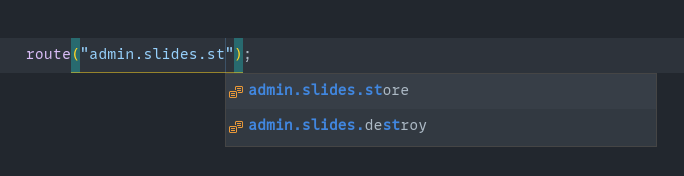

# Ziggy Routes

Ziggy route completion for vscode. Supports javascript and vue (vetur).

By default it watches web.php and automatically generates ziggy.js. This feature can be turned off from settings.

Tested only on linux. If this extension doesnt work for any reason, please let me know.

## Change log

Please see the [changelog](CHANGELOG.md) for more information on what has changed recently.

## Contributing

Pull requests are welcome!

## Todo

- Named parameter completion

## License

MIT. Please see the [license file](LICENSE.md) for more information.
